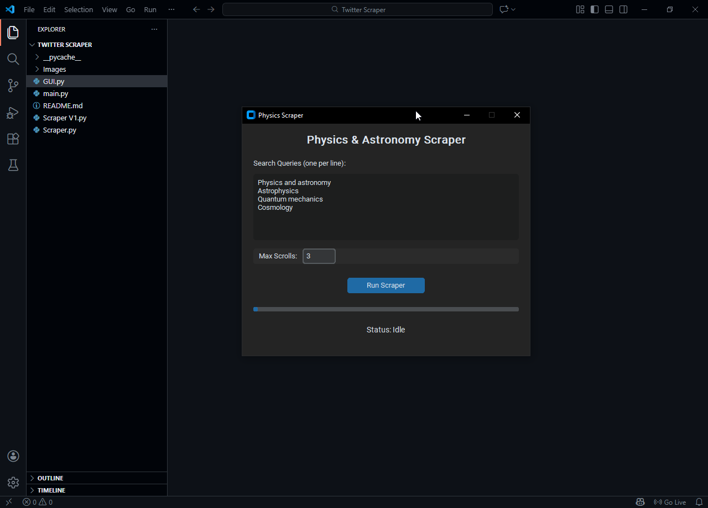
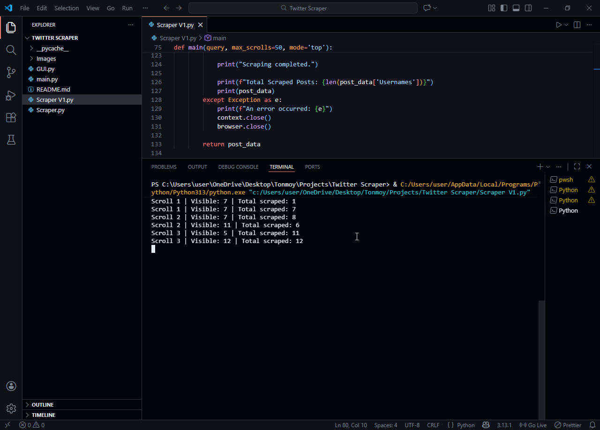
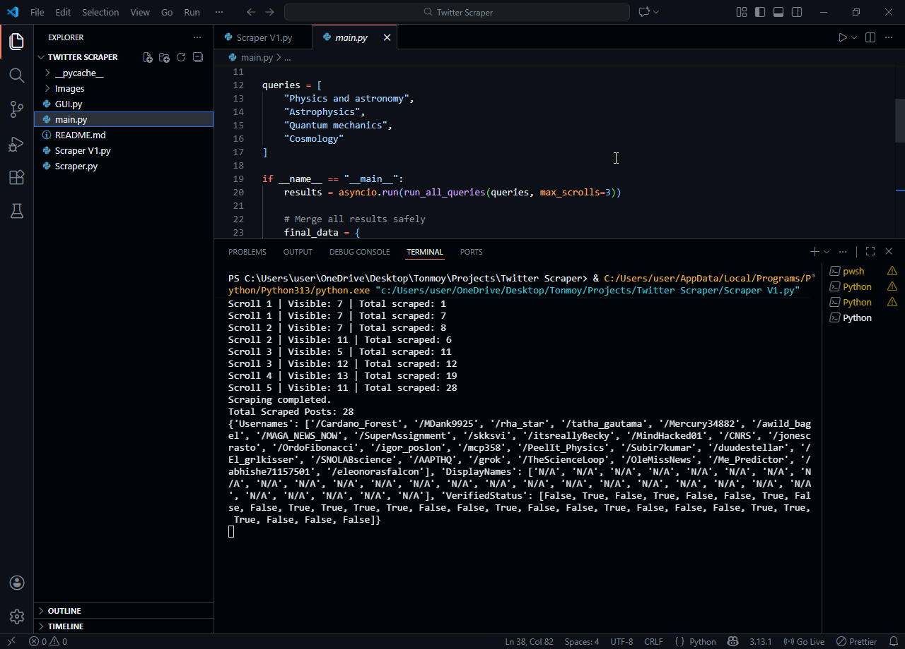

# 🔍 Twitter (X) Scraper

A high-performance web scraper for harvesting physics and astronomy-related posts from X (formerly Twitter) using Playwright. This is a project of one of my client. Actually thoughout the project I had to make different versions according to the client's need. You can choose your own version with sync, async, or GUI-based scraping!

---

## 🌟 Features

- **Multiple Scraping Modes**: Sync, Async, or GUI-based interfaces
- **Parallel Processing**: Scrape multiple queries and search modes simultaneously, increasing scraping speed by 4x
plus different mode given more data. 
- **Smart Deduplication**: Automatically removes duplicate posts from results
- **Infinite Scroll Handling**: Intelligently scrolls through feed, this version smoothly handles the DOM deletion process and detects when no new content loads
- **Resource Optimization**: Blocks unnecessary resources (images, videos, fonts) for faster scraping
- **User Verification Detection**: Identifies verified accounts (blue checkmarks)
- **Beautiful GUI**: Desktop application with progress tracking and real-time status updates for non-technical users.


## 📋 Prerequisites

- Python 3.8+
- Playwright (with Chromium browser)
- customtkinter (for GUI)

---

## 🚀 Installation

1. **Clone or download this project**
   ```bash
   cd Twitter\ Scraper
   ```

2. **Install dependencies**
   ```bash
   pip install playwright customtkinter
   ```

3. **Install Playwright browsers**
   ```bash
   playwright install chromium
   ```

---

## 🎯 Authentication Setup

> ⚠️ **Important**: You need valid X/Twitter authentication tokens to use this scraper.

Edit the authentication section in `Scraper.py` or `Scraper V1.py`:

```python
await context.add_cookies([
    {
        "name": "auth_token",
        "value": "YOUR_AUTH_TOKEN_HERE",
        "domain": ".x.com",
        "path": "/",
        "secure": True,
        "httpOnly": True
    },
    {
        "name": "ct0",
        "value": "YOUR_CT0_TOKEN_HERE",
        "domain": ".x.com",
        "path": "/",
        "secure": True
    }
])
```

To find your tokens, check your browser's cookies while logged into X. (Right-click → Inspect → Application/Storage → Cookies)

---

## 📖 Usage

### Option 1: GUI (Recommended for Users) 🎨
```bash
python GUI.py
```
Perfect for those who prefer clicking buttons over terminal commands!

**Features:**
- Enter search queries (one per line)
- Adjust max scroll depth
- Real-time progress tracking
- See total unique users found



---

### Option 2: Async Script (Recommended for Power Users) ⚡
```bash
python Scraper.py
```

Edit the `queries` list in the `__main__` section:
```python
queries = [
    "Physics and astronomy",
    "Astrophysics",
    "Quantum mechanics",
    "Cosmology"
]
```

**Why async?** It's blazingly fast! Uses async/await to handle multiple requests concurrently.



---

### Option 3: Main Runner (Maximum Performance) 🚄
```bash
python main.py
```

This wraps `Scraper.py` and runs all queries in parallel. Best for bulk scraping.


---

### Option 4: Sync Script (Legacy) 🐢
```bash
python Scraper\ V1.py
```

The original synchronous version. Slower but simpler to understand and debug. Great for learning!

---

## 📊 Output Format

All scrapers return data in the following structure:
```python
{
    'Usernames': ['/username1', '/username2', ...],
    'DisplayNames': ['Display Name 1', 'Display Name 2', ...],
    'VerifiedStatus': [True, False, ...]
}
```

---

## 🔧 Customization

### Adjust Scraping Depth
Change the `max_scrolls` parameter to control how deep the scraper goes. But it'll make it slower!:
```python
# Shallow scrape (fast)
results = asyncio.run(run_all_queries(queries, max_scrolls=3))

# Deep scrape (thorough)
results = asyncio.run(run_all_queries(queries, max_scrolls=50))
```

### Block/Unblock Resources
To load images, videos, etc. (slower but more thorough), modify in `Scraper.py`:
```python
# Remove or modify this route handler
await page.route("**/*", lambda route: (
    route.abort()
    if route.request.resource_type in ["image", "video", "font", "stylesheet"]
    else route.continue_()
))
```

---

## 📈 Performance Comparison

| Method | Speed | Scalability | Ease of Use |
|--------|-------|-------------|------------|
| GUI | Medium | Single query | ⭐⭐⭐⭐⭐ |
| Sync (V1) | Slow | Limited | ⭐⭐⭐ |
| Async (Main) | **Fast** | **Multi-query** | ⭐⭐⭐⭐ |
| Direct Python | **Fastest** | **Highly scalable** | ⭐⭐ |

---

## 🐛 Troubleshooting

**"No new tweets loading" warning appears immediately**
- The feed might be empty or authentication expired
- Check your auth tokens are valid
- Try a different search query

**Scraper runs but returns empty results**
- Verify you're logged into X in your browser
- Check that `auth_token` and `ct0` values are correct
- Ensure Playwright can access the page (network/firewall issues?)

**"Chromium not found" error**
- Run: `playwright install chromium`

**GUI doesn't start**
- Ensure `customtkinter` is installed: `pip install customtkinter`

---

## 📸 Screenshot Ideas

When adding screenshots, consider including:

1. **GUI Interface** - Main application window with search queries entered
2. **Terminal Output** - Console showing real-time scraping progress (scrolls increasing, unique users count)
3. **Results Example** - Display of collected usernames, display names, and verification status
4. **Multiple Queries Running** - Terminal showing async processing of multiple queries in parallel
5. **Statistics Dashboard** - Final results summary showing total unique users found

---

## ⚠️ Disclaimer

This tool is for educational and research purposes only. Ensure you comply with:
- X/Twitter's Terms of Service
- Local laws regarding web scraping
- Rate limiting and responsible usage

Always respect the platform's data and privacy policies.

---

## 📝 Project Structure

```
Twitter Scraper/
├── GUI.py              # Desktop application interface
├── Scraper.py          # Async version (recommended)
├── Scraper V1.py       # Sync version (legacy)
├── main.py             # Multi-query runner
├── README.md           # This file
└── __pycache__/        # Python cache
```

---

## 🤝 Contributing

Found a bug or have an idea? Feel free to improve this project!

---

**Happy(Actually it took a lot of headace 😅) Scraping! 🚀** (Responsibly, of course!)

**Contact me**: if you need a custom version, feel free to contact me.
